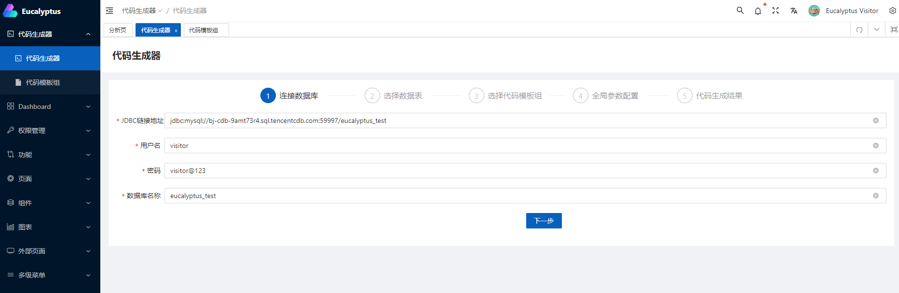

# Eucalyptus
[English](./README.en.md)

## 介绍

桉树(Eucalyptus)是一款免费开源的代码生成工具, 基于`Java`和[Spring生态](https://github.com/spring-projects) 开发, 使用了从数据库表到领域模型再到代码的设计思路

项目提供了开箱即用的基础方案, 也可进行深层次的定制开发

## 理念

在项目开发和后期迭代过程中, 我们将坚持以下理念:

- 桉树致力于成为程序员的助手
- 桉树只负责生成代码, 与低代码无关
- 代码要跑, 文档先行
- 简单优雅, 学习成本极低

## 功能

- [x] 数据库表生成代码
- [x] 代码模板组管理
- [x] 应用界面
- [x] 友好的二次开发
- [ ] 多数据源支持
- [ ] 主从表关联
- [ ] 多模板引擎支持
- [ ] ...

## 项目预览

- [桉树示例项目](https://eucalyptus.dxl.pink/): 每天定时重置数据

## 使用

根据实际需求, 可分为如下两种使用方式:

- [直接使用](#直接使用): 现有功能即可为您提供有效帮助, 快速启动开始
- [定制开发](#定制开发): 拥有开发环境, 快速集成或二次开发

### 直接使用

1. 本地安装Java 17环境, Linux推荐使用[SDKMAN](https://sdkman.io/)
2. 下载[最新发行版](https://github.com/koala-projects/eucalyptus/releases/tag/2022.0.0-SNAPSHOT)
3. 创建并使用[脚本](https://github.com/koala-projects/eucalyptus/tree/main/eucalyptus-core/src/main/resources)初始化数据库
4. 修改配置文件`config/application.yml`

```yaml
spring:
  datasource:
    driver-class-name: com.mysql.cj.jdbc.Driver
    url: jdbc:mysql://localhost:3306/eucalyptus?useUnicode=true&characterEncoding=utf-8&allowMultiQueries=true
    username: eucalyptus
    password: eucalyptus
eucalyptus:
  generator:
    # 临时目录
    temp-path: D:\\Temp\\eucalyptus\\
```

5. 启动项目: `./spring-cmd.sh start eucalyptus-2022.0.0-SNAPSHOT`
6. 访问`http://127.0.0.1:9999`, 开始使用代码生成器



### 定制开发

定制开发可分为集成与源代码开发, 本节主要讲述集成, 源代码开发请您参考[开发手册](./docs/develop/index.md)

桉树使用前后端分离开发模式, 后端基于[Spring Boot](https://github.com/spring-projects/spring-boot), 前端基于[Vue Vben Admin](https://github.com/vbenjs/vue-vben-admin)

当前仅后端提供了用于集成的组件`eucalyptus-spring-boot-starter`, 前端只能进行源代码开发

1. 增加Maven仓库

```xml
<repositories>
  <repository>
    <id>koala</id>
    <name>koala</name>
    <url>https://raw.github.com/Houtaroy/maven-repositories/snapshot/</url>
  </repository>
</repositories>
```

访问Github不方便的可以使用码云: `https://gitee.com/houtaroy/maven-repositories/raw/snapshot/`

2. 引入依赖

```xml
<dependencies>
  <dependency>
    <groupId>cn.koala</groupId>
    <artifactId>eucalyptus-spring-boot-starter</artifactId>
    <version>2022.0.0-SNAPSHOT</version>
  </dependency>
</dependencies>
```

3. 创建并使用[脚本](https://github.com/koala-projects/eucalyptus/tree/main/eucalyptus-core/src/main/resources)初始化数据库
4. 修改配置文件`application.yml`, 可参照[上一节](#直接使用)
5. 启动项目, 访问`http://127.0.0.1:9999/swagger-ui.html`可查看接口文档
6. 如需定制前端, 请参照[开发手册](./docs/develop/index.md)

### 代码模板

基于Enjoy模板引擎, 简单易用, 学习成本极低, 模板语法请参照[官方文档](https://jfinal.com/doc/6-1)

#### 上下文

系统默认代码生成器提供了如下三种领域上下文, 用于代码模板编辑:

1. 数据表上下文

| 键值                              | 名称           | 类型       | 描述                         |
| --------------------------------- | -------------- | ---------- | ---------------------------- |
| #(table.name)                     | 表名称         | 字符串     | 表名称                       |
| #(table.remarks)                  | 表备注         | 字符串     | 表备注                       |
| #(table.columns)                  | 列列表         | 列对象数组 | 列列表                       |
| #(table.columns[0].name)          | 列名称         | 字符串     | 列名称                       |
| #(table.columns[0].jdbcType)      | 列类型         | 枚举       | 列JDBC类型, 参照JDBCType枚举 |
| #(table.columns[0].size)          | 列长度         | 整型       | 列长度                       |
| #(table.columns[0].decimalDigits) | 列小数长度     | 整型       | 列小数长度                   |
| #(table.columns[0].remarks)       | 列备注         | 字符串     | 列备注                       |
| #(table.columns[0].nullable)      | 列是否允许为空 | 布尔       | 是否允许为空                 |
| #(table.columns[0].autoIncrement) | 列是否自增     | 布尔       | 列是否自增                   |
| #(table.columns[0].primaryKey)    | 列是否主键     | 布尔       | 列是否主键                   |

2. 增强表领域上下文, 对基础数据表上下文进行增强

| 键值                          | 名称             | 类型                            | 描述             |
| ----------------------------- | ---------------- | ------------------------------- | ---------------- |
| #(domain.naming)              | 表命名           | 命名对象(参照[命名](#命名)说明) | 表命名           |
| #(domain.primaryKey)          | 表主键           | 增强列对象                      | 表主键           |
| #(domain.primaryKey.naming)   | 表主键列命名     | 命名对象                        | 表主键命名       |
| #(domain.primaryKey.javaType) | 表主键列Java类型 | 字符串                          | 表主键列Java类型 |
| #(domain.enhancedColumns)     | 表增强列列表     | 增强列对象数组                  | 表增强列列表     |
| #(domain.enhancedColumns[0])  | 增强列           | 增强列对象                      | 增强列           |

3. 全局参数上下文

全局参数上下文可以在代码模板组中进行配置, 以简易Java模板为例:


| 键值                     | 名称 | 类型   | 描述 |
| ------------------------ | ---- | ------ | ---- |
| #(globalOptions.package) | 包名 | 字符串 | 包名 |

#### 命名

为了适配多种命名风格, 系统提供了命名定义, 以领域名称为例:

| 键值                                | 名称                 | 类型     | 描述                            |
| ----------------------------------- | -------------------- | -------- | ------------------------------- |
| #(domain.naming)                    | 表命名               | 命名对象 | 包名                            |
| #(domain.naming.camel())            | 表名称-驼峰风格      | 名称对象 | 表名称-驼峰风格                 |
| #(domain.naming.camel().singular()) | 表名称-驼峰风格-单数 | 字符串   | 表名称驼峰风格单数形式, myUser  |
| #(domain.naming.camel().plural())   | 表名称-驼峰风格-复数 | 字符串   | 表名称驼峰风格复数形式, myUsers |
| #(domain.naming.pascal())           | 表名称-帕斯卡风格    | 名称对象 | MyUser/MyUsers                  |
| #(domain.naming.underscore())       | 表名称-下划线风格    | 名称对象 | my_user/my_users                |
| #(domain.naming.kebab())            | 表名称-烤肉串风格    | 名称对象 | my-user/my-users                |

#### 示例

下面展示一个数据实体的代码模板示例:

```java
package #(globalOptions.package);

import lombok.Data;
import lombok.NoArgsConstructor;
import lombok.experimental.SuperBuilder;

/**
 * #(domain.remarks)数据实体
 *
 * @author Eucalyptus Generator
 */
@Data
@NoArgsConstructor
@SuperBuilder(toBuilder = true)
public class #(domain.naming.pascal().singular())Entity {
#for(column : domain.enhancedColumns)
  private #(column.javaType) #(column.naming.camel().singular());
#end
}
```

## 联系方式

如您有任何意见建议, 可以发送邮件至`koala_projects@yeah.net`

## 许可

[MIT © Eucalyptus 2022](./LICENSE)
