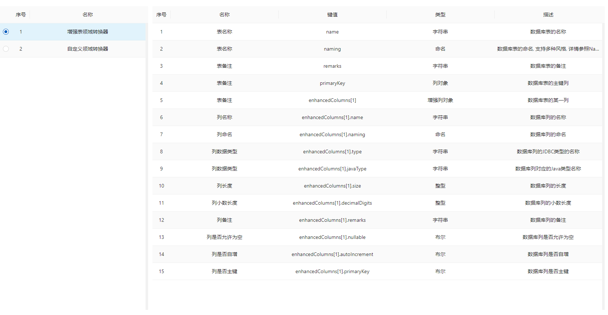

# 开发手册

## 介绍

桉树使用前后端分离开发模式:

- [后端](https://github.com/koala-projects/eucalyptus): 基于 Java / Spring Boot / MyBatis / Enjoy / Koala 开发
- [前端](https://github.com/koala-projects/eucalyptus-admin): 基于 TypeScript / Vue / Vue Vben Admin 开发

本文档主要介绍如何在代码生成过程中进行定制, 默认您已了解上述技术栈

支持的开发内容:

- [x] [领域转换器](#领域转换器)
- [x] [代码生成器](#代码生成器)
- [x] 代码模板组服务
- [ ] 数据源接入
- [ ] ...

## 概念

- 领域模型: 即业务对象模型, 是整个代码生成过程中的核心内容
- 领域转换器: 将数据库表转换为领域模型
- 上下文: 代码生成过程中的数据, 如数据库表上下文/领域模型上下文
- 代码模板组: 一组代码模板文件
- 代码生成器: 根据上下文, 将代码模板组渲染为最终代码结果

## 思路

桉树是一款用于帮助程序员快速生成基础代码的开发工具, 它的生成逻辑如下:


系统基于 Spring Boot 设计理念, 支持对主要服务的定制与替换

## 开发环境

- Java JDK 17
- Node.js v16.15.1

## 领域转换器

系统默认提供了增强表领域转换器`EnhancedTableDomainConverter`, 对数据库表信息进行了处理, 便于部分基础代码的生成

如果当前领域转换器不能满足您的需求, 可以进行自定义开发:

1. 创建自定义领域转换器类, 实现接口`DomainConverter`

```java
@Data
public class MyDomainConverter implements DomainConverter {
    
  // 转换器唯一标识
  private String id = "my-domain-converter";
  // 转换器名称
  private String name = "自定义领域转换器";
    
  @Override
  public Object convert(Table table) {
    // 转换代码...
  }
    
  @Override
  public List<DomainProperty> getProperties() {
    // 转换参数说明...
  }
}
```

2. 将自定义领域转换器类注入到Spring容器中

```java
@Component
public class MyDomainConverter implements DomainConverter {
    // 转换器代码...
}
```

3. 重启项目, 在创建代码模板时即可选择刚刚的自定义领域转换器



## 代码生成器

系统提供了基于 Enjoy 模板引擎的代码生成器`DefaultGenerator`

如果当前代码生成器不能满足您的需求, 可以进行自定义开发:

1. 创建自定义代码生成器类, 实现接口`Generator`

```java
public class MyGenerator implements Generator {
  @Override
  public List<GenerateResult> generate(CodeTemplateGroup group, Table table, Map<String, Object> globalOptions) {
    // 代码生成...
  }
}
```

2. 将自定义代码生成器类注入到Spring容器中

```java
@Component
public class MyGenerator implements Generator {
  // 生成器代码...
}
```

自定义代码生成器会替换默认代码生成器

> 自定义代码生成器可用于替换模板引擎, 例如将 Enjoy 更换为 Freemarker

## 其他

系统支持以下 Bean 的定制:

- 领域转换器服务类: `DomainConverterService`
- 代码模板组服务类: `CodeTemplateGroupService`

## 前端

1. 克隆或下载前端源代码

```bash
git clone git@github.com:koala-projects/eucalyptus-admin.git
```

2. 安装依赖

```bash
yarn install
```

3. 启动开发服务器

```bash
yarn dev
```

