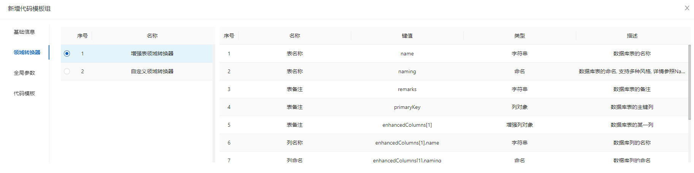
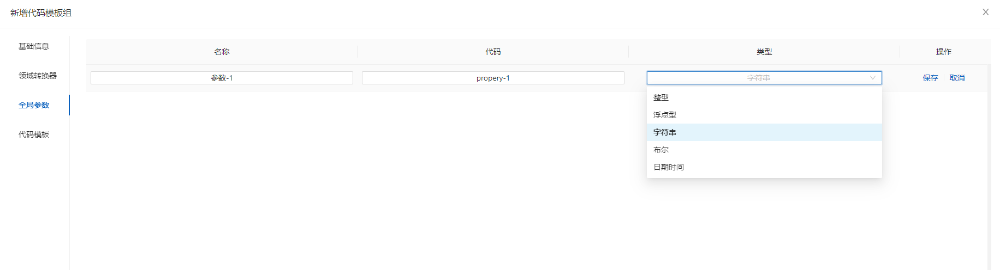
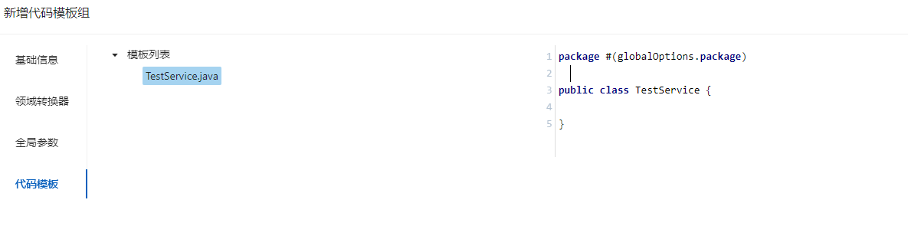
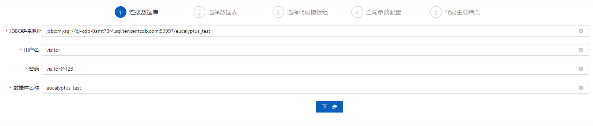
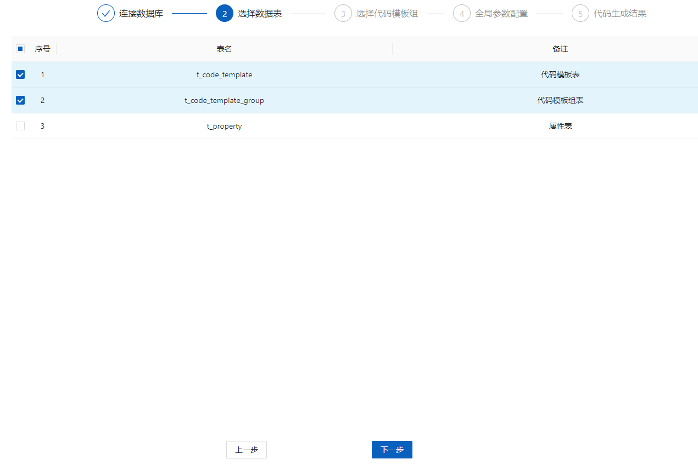
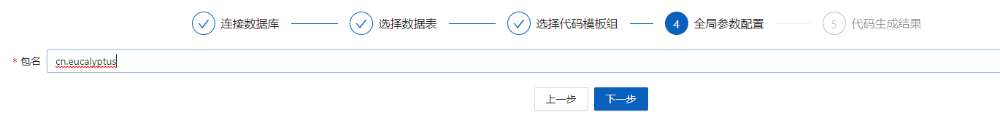
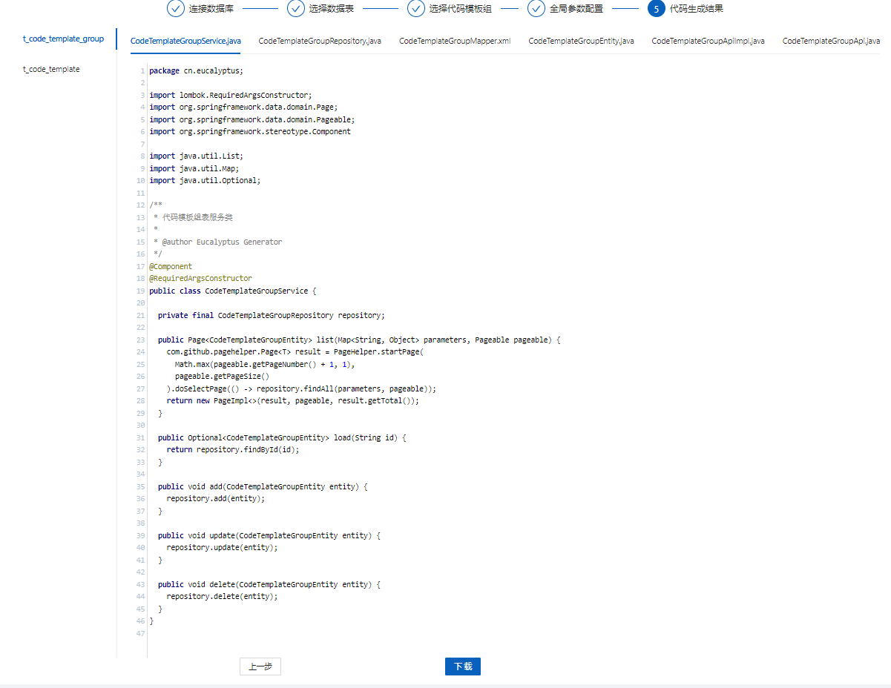

# 使用手册

桉树提供了两个功能模块帮助程序员们快速生成代码: 

- 代码模板组: 负责配置和管理代码模板
- 代码生成器: 用于生成代码

## 代码模板组

代码模板组包含代码模板的增删改查功能, 本手册以新增为例:

1. 点击新增按钮, 打开代码模板组表单
2. 填写基础信息


3. 选择领域转换器, 右侧会展示该转换器提供的上下文属性



4. 配置全局参数




5. 编辑代码模板




## 代码模板

基于Enjoy模板引擎, 简单易用, 学习成本极低, 模板语法请参照[官方文档](https://jfinal.com/doc/6-1)

### 上下文

系统默认代码生成器提供了如下三种领域上下文, 用于代码模板编辑:

1. 数据表上下文

| 键值                              | 名称           | 类型       | 描述                         |
| --------------------------------- | -------------- | ---------- | ---------------------------- |
| #(table.name)                     | 表名称         | 字符串     | 表名称                       |
| #(table.remarks)                  | 表备注         | 字符串     | 表备注                       |
| #(table.columns)                  | 列列表         | 列对象数组 | 列列表                       |
| #(table.columns[0].name)          | 列名称         | 字符串     | 列名称                       |
| #(table.columns[0].jdbcType)      | 列类型         | 枚举       | 列JDBC类型, 参照JDBCType枚举 |
| #(table.columns[0].size)          | 列长度         | 整型       | 列长度                       |
| #(table.columns[0].decimalDigits) | 列小数长度     | 整型       | 列小数长度                   |
| #(table.columns[0].remarks)       | 列备注         | 字符串     | 列备注                       |
| #(table.columns[0].nullable)      | 列是否允许为空 | 布尔       | 是否允许为空                 |
| #(table.columns[0].autoIncrement) | 列是否自增     | 布尔       | 列是否自增                   |
| #(table.columns[0].primaryKey)    | 列是否主键     | 布尔       | 列是否主键                   |

2. 增强表领域上下文, 对基础数据表上下文进行增强

| 键值                          | 名称             | 类型                            | 描述             |
| ----------------------------- | ---------------- | ------------------------------- | ---------------- |
| #(domain.naming)              | 表命名           | 命名对象(参照[命名](#命名)说明) | 表命名           |
| #(domain.primaryKey)          | 表主键           | 增强列对象                      | 表主键           |
| #(domain.primaryKey.naming)   | 表主键列命名     | 命名对象                        | 表主键命名       |
| #(domain.primaryKey.javaType) | 表主键列Java类型 | 字符串                          | 表主键列Java类型 |
| #(domain.enhancedColumns)     | 表增强列列表     | 增强列对象数组                  | 表增强列列表     |
| #(domain.enhancedColumns[0])  | 增强列           | 增强列对象                      | 增强列           |

3. 全局参数上下文

全局参数上下文可以在代码模板组中进行配置, 以简易Java模板为例:


| 键值                     | 名称 | 类型   | 描述 |
| ------------------------ | ---- | ------ | ---- |
| #(globalOptions.package) | 包名 | 字符串 | 包名 |

### 命名

为了适配多种命名风格, 系统提供了命名定义, 以领域名称为例:

| 键值                                | 名称                 | 类型     | 描述                            |
| ----------------------------------- | -------------------- | -------- | ------------------------------- |
| #(domain.naming)                    | 表命名               | 命名对象 | 包名                            |
| #(domain.naming.camel())            | 表名称-驼峰风格      | 名称对象 | 表名称-驼峰风格                 |
| #(domain.naming.camel().singular()) | 表名称-驼峰风格-单数 | 字符串   | 表名称驼峰风格单数形式, myUser  |
| #(domain.naming.camel().plural())   | 表名称-驼峰风格-复数 | 字符串   | 表名称驼峰风格复数形式, myUsers |
| #(domain.naming.pascal())           | 表名称-帕斯卡风格    | 名称对象 | MyUser/MyUsers                  |
| #(domain.naming.underscore())       | 表名称-下划线风格    | 名称对象 | my_user/my_users                |
| #(domain.naming.kebab())            | 表名称-烤肉串风格    | 名称对象 | my-user/my-users                |

### 示例

下面展示一个数据实体的代码模板示例:

```java
package #(globalOptions.package);

import lombok.Data;
import lombok.NoArgsConstructor;
import lombok.experimental.SuperBuilder;

/**
 * #(domain.remarks)数据实体
 *
 * @author Eucalyptus Generator
 */
@Data
@NoArgsConstructor
@SuperBuilder(toBuilder = true)
public class #(domain.naming.pascal().singular())Entity {
#for(column : domain.enhancedColumns)
  private #(column.javaType) #(column.naming.camel().singular());
#end
}
```

## 代码生成器

1. 填写数据库连接信息



2. 选择要生成代码的数据库表



3. 选择代码模板组


4. 填写全局参数



5. 预览代码结果并下载


